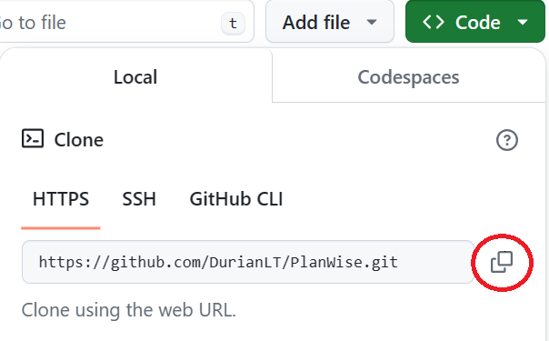
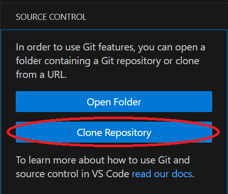
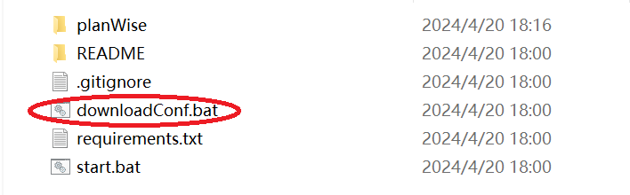
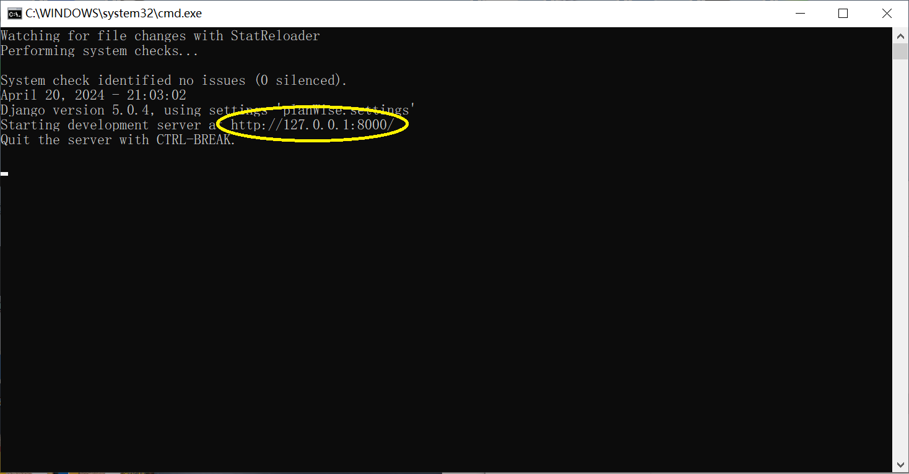

# Project Name: PlanWise

A project of software engineer, making a schedule based on email scraping

## Project Description

This project is an efficient tool specifically designed to automatically capture dates and schedule them. 

It uses Django as a backend Server based on Python, and use HTML, CSS and JS as frontend interface.

It will allow users to associate with their **Outlook Email or Gmail**, and set or edit their account information. 

Once the date is captured, it is automatically added to the user's schedule. User can also add or edit schedule by themselves individually.

## Project Struction

Below is the whole structure of the PlanWise project

.png)
.png)

Here is the key function of application within project:

- `planWise/settings.py`: Configures settings for the Django project, including installed apps, database, etc.
- `mailhandler/emailprocessing/base.py`: Implemented user authentication and the reading of the user's email.
- `mailhandler/views.py`: Enables email analysis and database import, as well as back-end and front-end contact and model mapping.
- `mailhandler/forms.py`: To generate an HTML form that allows users to submit event information, including date and time, address, event details, and comments.
- `user/forms.py`:Create some forms for the CustomUser model that are related to Django user management, including creating and modifying users, and provide custom representations for some fields.
- `user/views.py`: Implemented a user sign-up view using a custom form that redirects to a login page after a user has successfully signed up.
- `catch_date/views.py`: Create a event management function that users can use to create, browse, update, delete and view their event details, and in the event list, events can be sorted by time and display a countdown for each event.

## Getting Start

### Installation

Clone Project from GitHub repostories use VS Code
- Clone the URL

- Use VS Code and open source control then choose **Clone Repository**

Then input the URL to finish clone.

Or you can use Command to clone project with Git command

```bash
# git command
git clone https://github.com/DurianLT/PlanWise.git
```

Then double click the file `downloadConf.bat` to configuration 


When you see the **Please press any key to continue...**, click Enter of your keyboard to finish configuration.

It will automatically to configurate with `requirements.txt`, which is a Django dependencies file with many necessary packages. 

### Run applications
After finish the configuration, double click the `start.bat`
.png)

Then it will show the host URL

- You can directly click it with `Ctrl + Left mouse button` to see tha application interface.

- Or you can type http://localhost:8000/ on your web browser as well.

## Features of Software

- **Automation**: The tool can automatically capture schedule information and schedule it into the user's schedule. 
- **Support for multiple email services**: Allows users to link their Outlook or Gmail accounts.
- **Personalized schedule management**: Users can set or edit personal information, and add and edit schedules automatically or manually.

## Purpose of the software

### Type of Software Development Process

- This porject uses the [**Waterfall model**](https://en.wikipedia.org/wiki/Waterfall_model) process.

### Why Chose Waterfall

The decision was based on several key factors:

- **Well-defined Requirements**: The project has well-defined requirements from the outset, with little expected change. The Waterfall model's sequential approach allows for thorough planning and execution in such scenarios.
- **Project Complexity**: Given the complexity and scale of the project, the Waterfall model provides a systematic approach. Each phase has specific deliverables.
- **Easy to understand and implement**: The waterfall model is structured in a intuitive way, and easy to understand, especially for novices or teams of students. It provides a clear guidance framework to help team members understand their roles and responsibilities in the project.
- **Risk Management**: Although Agile is known for early risk identification, the project's scope and scale mean that upfront planning can effectively mitigate most risks.

Choosing Waterfall supports our need for strict project management, and dealing with complex, large-scale projects.

### Possible usage of Software (Target Market)

The software is primarily intended for groups that need to effectively manage, consolidate, and access events or meetings received via email, including but not limited to:

- **Business Professionals**: The software automates the email schedule management process, helping these busy professionals save time and avoid missing any important events.
- **Educational institutions**: Educators alike need to properly manage and outline their schedules, and our software can reduce the complexity and time consuming of handling these tasks.

## Software development plan

### Development Process

- **Project Management and Collaboration**: Tasks are managed with GitHub issues. We discuss problems, propose solutions within GitHub, ensuring all team members can easily follow the project's progress and participate in discussions. 
- **Workflow and Timeline**: Our project is divided into several phases. Each phase corresponds to a particular set of features for the application.
 
### Members

- **Lawrrence**: Mainly responsible for the construction of the framework, the construction of the basic project structure, the construction and beautification of front-end web pages, and the repair and testing of some bugs.

- **Chieri**: Responsible for implementing the logic to access user emails through two-factor authentication, managing the retrieval and database integration processes, and displaying the information on the frontend. This includes using JavaScript to enable real-time updates of emails on the frontend and their simultaneous storage in the backend database. Additionally, I am tasked with developing a ChatGPT AI interface for analyzing the content of the emails. The results of this analysis are automatically used to generate forms that users can decide whether to add to their schedules. I am also in charge of creating a schedule interface that sorts entries by ID and deadline.

- **Keith**: Mainly responsible for fixing some bugs and changing the content of HTML.

- **Oscar**：Responsible for writing a application which allows user to operate their events.

### Schedule

|                  *Mar 5-14 2024*                  |         *Mar 20-Apr 19 2024*          | *Apr 20 2024* |
|:-------------------------------------------------:|:-------------------------------------:|:-------------:|
|Project theme design and development tool selection|Implementation and modification of code|Testing and End|

### Algorithm

Our overall project uses an algorithm of cumulative iterations.

This is a example code from one of the applications.

```python
# mailhandler/emailProcessing/base.py
def analyze_email_content(email_content):
    url = "http://154.44.10.169:1145/analyze_email"
    data = {"email_content": email_content}
    response = requests.post(url, json=data)
    if response.status_code == 200:
        return response.json()
    else:
        print("Failed to get a successful response from the API. Status Code:", response.status_code)
        return None
```
Evolve according to the evolution of project needs. Initially, it may be as simple as extracting some basic information, and later more complex text analysis and processing logic may be added to extract more valuable data.

### Current status of the software

- **Version**: PlanWise 2.0 which has fixed bugs and improve functionality.
- **Implemented Features**: Automatically capture emails and allow users to independently modify schedules, with a countdown designed for the end of the schedule.

### Future plan

We will continue to improve the user experience of our software to make it more relevant to the diverse needs of work. We plan to develop a more intuitive interface and add more features for schedule management, such as prioritization, tagging, etc. We also welcome feedback and suggestions from users to work together to take this project to the next high level.

## Appendix

### Demo

[Watch Video](https://www.youtube.com)

### Environments

- Programming Language: Python version >= **3.10**, Django == **5.0.4**
- Successful configure file with the content of `requirements.txt`
- Package Name:
    `asgrief`, `bs4`, `certifi`, `charset-normalizer`, `distilb`, `Django`,
    `filelock`, `idna`, `impaclient`, `lxml`, `pipenv`, `platformdirs`, `pytz`, `requests`, `setuptools`, `soupsieve`, `sqlparse`, `tzdata`, `urllib3`

### Declaration
- `asgiref`: A reference implementation of the ASGI specification. It is used to support asynchronous web applications.
- `bs4(beautifalsoup4)`: Used to parse HTML and XML documents.
- `certifi`: Mozilla's CA certificate package is provided to validate HTTPS requests.
- `charset-normalizer`: Used for character set detection, especially when working with text files.
- `distilb`: A set of low-level components for packaging and distributing Python software is provided.
- `Django`: A high-level Python web framework that encourages rapid development and clean, functional design.
- `filelock`: Used to implement file locking in Python to prevent conflicts when writing concurrently.
- `idna`: Implemented Internationalized Domain Name (IDNA) support for handling international domain names.
- `impaclient`: Simplified IMAP (Internet Message Access Protocol) provides an easy-to-use interface for interacting with IMAP servers, such as reading emails, searching for messages, processing messages, etc.
- `lxml`:A powerful and Pythonic XML and HTML processing library, based on libxml2 and libxslt.
- `pipenv`: Provides a tool for Python development workflows for managing dependencies and virtual environments.
- `platformdirs`: Used to access platform-specific data and profile directories.
- `pytz`: Deals with time zone issues, and it allows for precise and cross-platform time zone calculations.
- `requests`: It is used to send HTTP requests to obtain web content.
- `setuptools`: Used to package Python projects for easy distribution and installation.
- `soupsieve`: Used to provide support for CSS selectors for BeautifulSoup.
- `sqlparse`: A non-validated SQL parser for parsing SQL statements.
- `tzdata`: Time zone data packets to provide time zone support in conjunction with the pytz library.
- `urllib3`: A powerful, user-friendly HTTP client library for sending HTTP requests.

### API Usage Statement - Email Content Analysis Service

1. Overview

    - This document provides the terms and conditions of use for the Email Content Analysis API (“the API”) designed to offer developers automated analysis of email content, utilizing the ChatGPT 3.5 interface for intelligent parsing.

2. Access and Authentication

	- **API Endpoint**: http://154.44.10.169:1145/analyze_email
	- **Authentication**: Currently, the API can be accessed without authentication. Future implementations may introduce API key authentication, and users will be notified in advance.

3. Terms of Use

	- **Commercial Use**: This API is available for both non-commercial and commercial applications at no charge.
	- **Data Policy**: All data submitted through this API will not be stored or used for purposes other than providing the requested service.
	- **Attribution Requirement**: Applications using this API are not required to provide attribution.

4. Request and Response Format

	- **Method**: POST
	- **Request Parameters**:
	- **email_content (string)**: The email text content to be analyzed.
	- **Successful Response**: HTTP Status Code: 200
	- **Return Format**: JSON, containing analysis results.
	- **Failed Response**: Non-200 HTTP status codes indicate a failed request, possible reasons include server errors or issues with request parameters.

5. Rate Limits
    - There are currently no limits on the number of API calls. This may change based on service load and will be adjusted with future policy updates.

6. Sample Code

    ```python
    def analyze_email_content(email_content):
        url = "http://154.44.10.169:1145/analyze_email"
        data = {"email_content": email_content}
        response = requests.post(url, json=data)
        if response.status_code == 200:
            return response.json()
        else:
            print("Failed to get a successful response from the API. Status Code:", response.status_code)
            return None
    ```

7. Support and Contact Information

    - For problems encountered while using the API, or for technical support, please contact us through:

	    - **Email**: sccyduanlu@outlook.com

    - All interpretations of this statement are reserved by **Chieri Ko**. We retain the right to update and modify this statement at any time.
